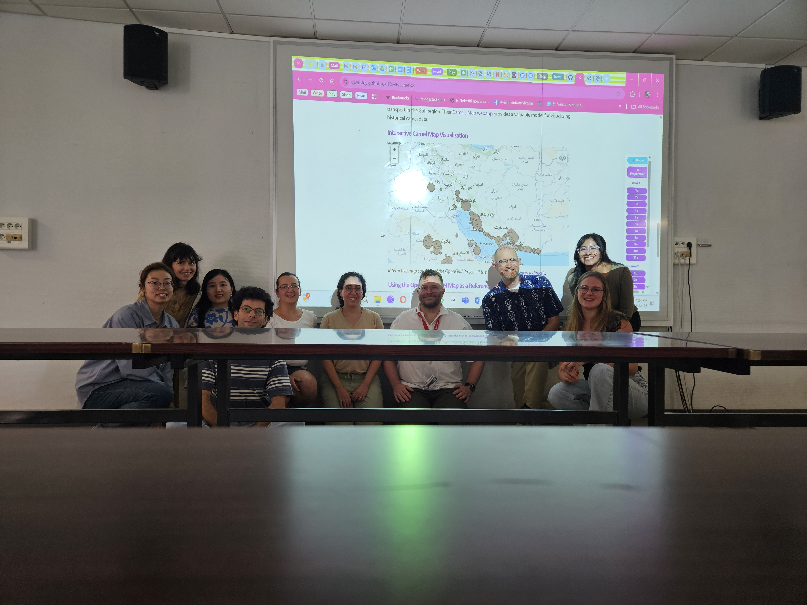

# Mapping in Besançon

Welcome to the `mapping_aficionados` project for the **"Humanities Data and Mapping Environments"** workshop at ESU 2025!

In the ESUDH 2025, we worked on a number of Besançon specific projects. First, we took an example from the Annuaire du Doubs (a local regional directory) and from the subsection known as "Liste des habitants de Besançon" and created a map color coded by profession.

First, we took an interest in the distinctive stone that adorns many of the façades of the buildings in the historical center of Besançon (known as "la Boucle").

The more we looked at the stones the more we realized that some of them contain figures, the way that one might find a subjective perceptions in inkblots in a Rorschach test. Everyone sees slightly different things, but we decided to record these and tag them to make a map.

Here is a visual of what it looks like so far:

What we've been doing so far in the course? We have prepared a [brief summary](workshop/week1_summary.md) of it!

## Week 1 Project 
### The Journey to Besançon: A Spatial Narrative of ESU workshop participants trajectories

This project visualizes the collective journey of our workshop participants from around the globe to our meeting point in Besançon, France. Using Kepler.gl, we transform a simple dataset of departure points and travel stops into a rich spatial narrative, telling the story of how our academic community comes together.

Our initial project mapped our travels to Besancon. There are several different visualizations that can be seen [here](Project_Week1.md)

## Week 2 Project
### Project Stone

The larger project is a collection of our photographs of interesting images we saw on the rock walls of the buildings in the city. There is a [page](Project_Week2.md) describing the project and what *we* saw on the walls. You will doubtless see other things.

---
# Workshop Photos

Here are some photos from the [workshop](Photos.md)
